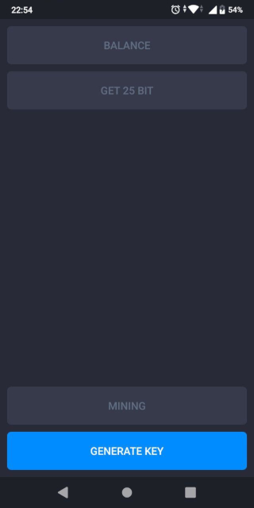
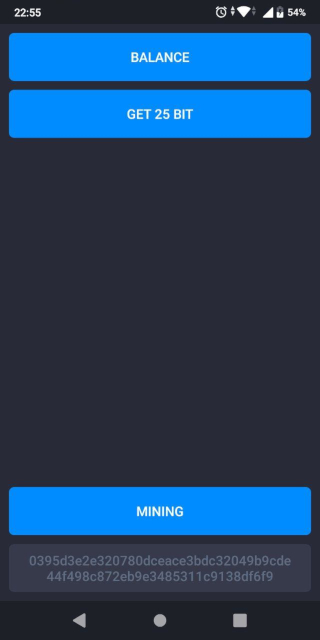

# android-slim
Demo app for Enecuum Android mining lib (https://github.com/Enecuum/android-lib).

The first step of an application usage is to generate a pair of keys: | The second step is to get 25 bit, check the balance and start mining:
--- | --- 
|

You can get 25 BIT only in default test BIT network.

If you change entry point to the production (Pulse network) or other networks, you will want to have full control over the private key. You can do it by setting the private key inside HomeFragment's signIn() function.

When mining process is started a notification is showing.

App demonstrates the capabilities of the library (https://github.com/Enecuum/android-lib) for connecting to Enecuum services and mining. Library is connecting using Jitpack (https:/jitpack.io). Library supports connecting to testnet BIT or mainnet Pulse networks. Correct connection parameters are set using ApiRouter library class like that:

```kotlin
//Get connection parameters stub. Parameter "true" selects testnet connection endpoint, "false" chooses the mainnet.
val setter = ApiRouter.getConnectionSetter(true)

//Or define a custom value for any connection parameter.
setter.ip = "new ip value"

//Set new connection parameters  
ApiRouter.setter = setter
```

Connection parameters should be sent before connection attempt.
If not set, the default values for development connection will be used.

For interacting with the library classes of package com.enecuum.lib should be used. 
For instance, package com.enecuum.lib.api contains methods for interacting with Enecuum servers from application.


